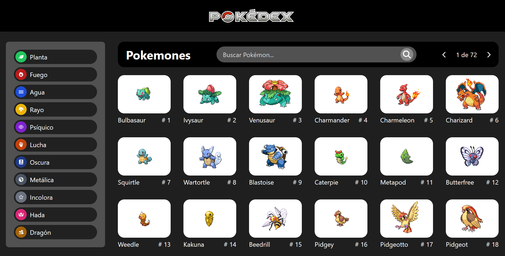

# PokeDex

Esta aplicación Pokedex te permite explorar y obtener información sobre diferentes Pokémon. Es una aplicación desarrollada con React, Vite, TailWindCss en la cual se utiliza axios para consumir la API y FontAwesome para los iconos.

## Características

Aunque actualmente solo permite visualizar una lista de pokemones, pronto le estaré agregando las funciones:

- Buscar Pokémon por nombre.
- Filtrar Pokémon por tipo.
- Ver detalles de cada Pokémon, como estadísticas y habilidades.

## Vista Previa
